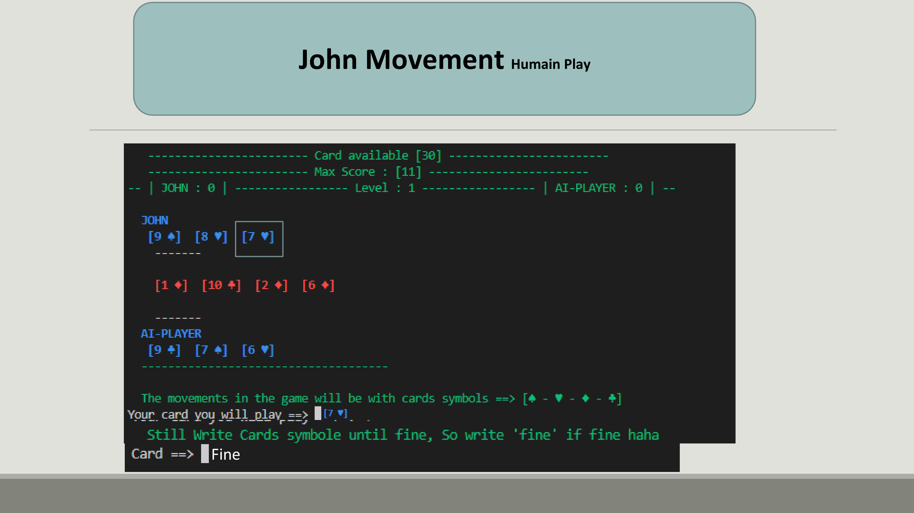

<h6 align="center">
  
</h6> 
 
<h1 align="center"> Python - Game Using Advanced Algorithm </h1>

- It's Tunisian Card Game "CHKOBA"

- To play run 
$ `python main.py` 

- Use "Copy/Past" from teminal to choose your cards to play

- In my code :

* gamer1 == > Human who is you when you play vs AI 
* gamer2 == > AI Player

* 7aya  == > card had as symbol 7 coeur 
* sab3a == > card had seven as value 
* karta == > when gamer had more 20 card in score box 

* GUIDE OF GAME 

